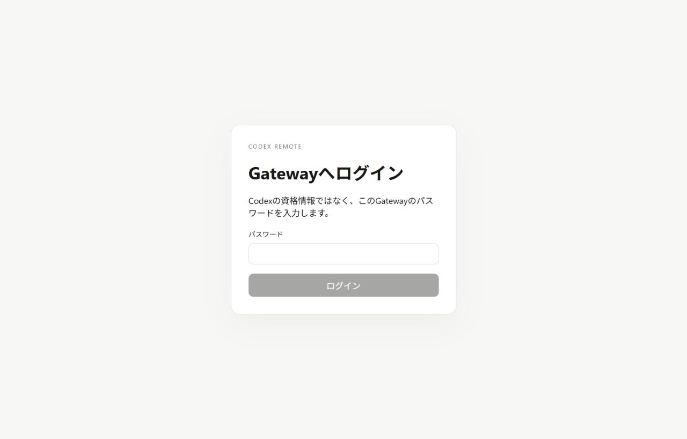
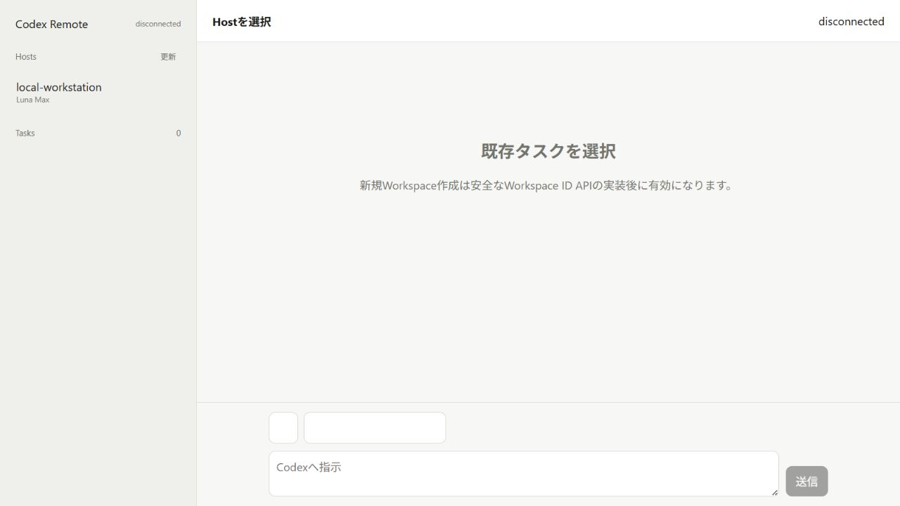
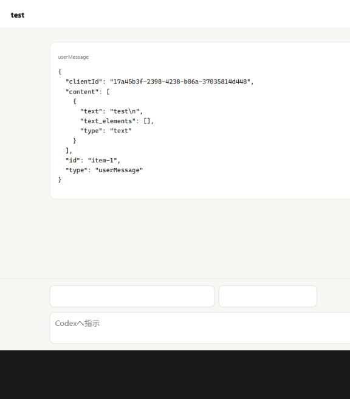

# hutoncodex

hutoncodexは、別端末のWebブラウザからHost Agentを経由し、開発端末上の`codex app-server`を操作するためのクライアントです。

リポジトリは[harunoya/hutoncodex](https://github.com/harunoya/hutoncodex)で公開しています。

現在は、TauriフロントエンドからWeb Gateway構成へ移行中です。
既存のTauri 2 + React実装は、Web版で必要な機能が揃うまでリポジトリ内に残しています。

```text
Browser -- HTTPS/WSS --> Rust Gateway <-- outbound WSS -- Rust Host Agent -- stdio --> codex app-server
```

## 現在の実装範囲

- Rust Gatewayによるログイン、Cookieセッション、CSRF検証
- 有効期限付き・一回限りのWebSocket ticket
- Rust Host AgentからGatewayへの外向きWebSocket接続
- Host Agentによる`codex app-server --stdio`の起動と初期化
- Host、ブラウザセッション、接続世代、RPC IDの所有権分離
- App Serverのタスク一覧、既存タスク表示、ターン開始、通知受信
- `model/list`に基づくモデルと推論レベルの選択
- `gpt-5.6-luna`と`max`推論レベルの利用可否判定
- Host Agentに指定したWorkspace外への要求を拒否する検証
- React製Web UI

Luna Maxは、Host Agentが`model/list`から`gpt-5.6-luna`と`max`の組み合わせを検出した場合だけ利用可能として扱います。
サブエージェントのデータ型は定義済みですが、自動起動、キュー管理、親子タスク同期はまだ実装していません。

## 画面

### Gatewayへのログイン

Codexの資格情報ではなく、Gateway管理者が設定したパスワードを入力します。



### Host Agentとタスク一覧

ログイン後、接続済みのHost Agentを選択すると、App Serverから取得したタスクがWorkspaceごとに表示されます。



### 既存タスクの表示

Hostを選択し、ローカルApp Serverから既存のテストタスクを開いた状態です。
モデル、推論レベル、入力欄は、App Serverが提供する機能だけを表示します。



これらの画像は、ローカルでGateway、Host Agent、Codex App Serverを実際に起動して取得したものです。
撮影では既存タスクの表示までを確認し、新しいターンは開始していません。

## 構成

| パス | 役割 |
| --- | --- |
| `services/gateway` | Web UI配信、認証、ブラウザとHost Agent間の中継 |
| `services/host-agent` | App Serverの起動、初期化、Workspace検証、Gateway接続 |
| `crates/app-server-client` | 上限付きstdio JSONLクライアント |
| `crates/session-core` | User、Browser session、Host generationの状態管理 |
| `crates/remote-protocol` | GatewayとHost Agent間の型、Luna Max capability判定 |
| `src/WebApp.tsx` | Web Gateway用React UI |
| `src/App.tsx` | 移行期間中に保持しているTauri UI |
| `src-tauri` | 既存Tauriバックエンド |

## 必要な環境

- Node.js 22以降
- Rust toolchain
- ログイン済みの`codex` CLI
- ローカル確認ではPowerShell
- Tauri版をビルドする場合は、Tauri 2のWindows前提ツール

## ローカルでの起動

依存関係とWeb UIを準備します。

```powershell
npm install
npm run build
cargo build --workspace
```

Gateway用パスワードは12文字以上、Host tokenは32文字以上にします。
次の値は例です。本番用の値をリポジトリへ保存しないでください。

```powershell
$env:HUTONCODEX_ADMIN_PASSWORD="replace-with-a-local-password"
$env:HUTONCODEX_HOST_TOKEN="replace-with-a-random-host-token-32chars"
cargo run -p hutoncodex-gateway
```

別のPowerShellでHost Agentを起動します。
`--workspace`には、ブラウザから操作を許可するディレクトリの絶対パスを指定します。

```powershell
$env:HUTONCODEX_HOST_TOKEN="replace-with-a-random-host-token-32chars"
cargo run -p hutoncodex-agent -- connect `
  --gateway ws://127.0.0.1:8787 `
  --host-id 11111111-1111-4111-8111-111111111111 `
  --display-name local-workstation `
  --workspace C:\absolute\workspace
```

ブラウザで`http://127.0.0.1:8787`を開き、Gateway用パスワードでログインします。

Host Agent単体の確認には次のコマンドを使えます。

```powershell
cargo run -p hutoncodex-agent -- doctor
cargo run -p hutoncodex-agent -- app-server probe
```

詳しい開発用手順は[docs/deployment.md](docs/deployment.md)を参照してください。

## Tauri版

移行期間中のTauri版は、次のコマンドで起動できます。

```powershell
npm run tauri:dev
```

Tauri版にはPairコード、QR Pair、公式Relay、上級者向けWebSocket接続の既存実装があります。
ただし、公式PairとRelayの実サービスを使った一連の動作は、現在のWeb Gateway確認では再検証していません。

App Serverの型を現在のCodex CLIから再生成する場合は、次を実行します。

```powershell
npm run protocol:generate
```

生成物は`.generated/`へ出力され、Gitには含めません。

## セキュリティ上の制約

ブラウザへCodex token、Host token、端末鍵を渡さない構成です。
一方、現在のGatewayはローカル開発用であり、インターネット公開に必要な条件を満たしていません。

公開前には、少なくとも次の実装と運用が必要です。

- HTTPS終端と`--secure-cookies`
- `HUTONCODEX_PUBLIC_ORIGIN`の固定
- Host enrollment、token rotation、失効処理
- 永続User、Host、Workspaceデータベースとmigration
- request、turn、user単位のrate limit
- 監査ログとsecret redaction
- App Server schemaの完全な検証
- バックアップ、復旧、アップグレード、rollback手順

これらが未完了のため、現在のGatewayを直接インターネットへ公開しないでください。
Tailscale内で使用する場合も、HTTPS、端末ACL、Gateway認証を省略しないでください。

## テスト

```powershell
npm test
npm run build
cargo fmt --all -- --check
cargo clippy --workspace --all-targets -- -D warnings
cargo test --workspace
cargo build --workspace
```

既存Tauri版も確認する場合は、次を追加で実行します。

```powershell
cargo fmt --manifest-path src-tauri/Cargo.toml -- --check
cargo clippy --manifest-path src-tauri/Cargo.toml --all-targets -- -D warnings
cargo test --manifest-path src-tauri/Cargo.toml
```

## 未実装または未確認

- Luna Maxサブエージェントの自動起動、キュー、キャンセル、親子タスク同期
- Host enrollmentとtoken rotation
- 永続データベース
- インターネット公開を前提とした運用構成
- Web版での公式Pair／QR Pair／Relay接続
- 今回の確認環境での新規ターン実行
- Android実機でのWeb Gateway構成

Web Gatewayの設計方針は[IMPLEMENTATION_POLICY.md](IMPLEMENTATION_POLICY.md)、公開前条件は[docs/deployment.md](docs/deployment.md)を参照してください。
